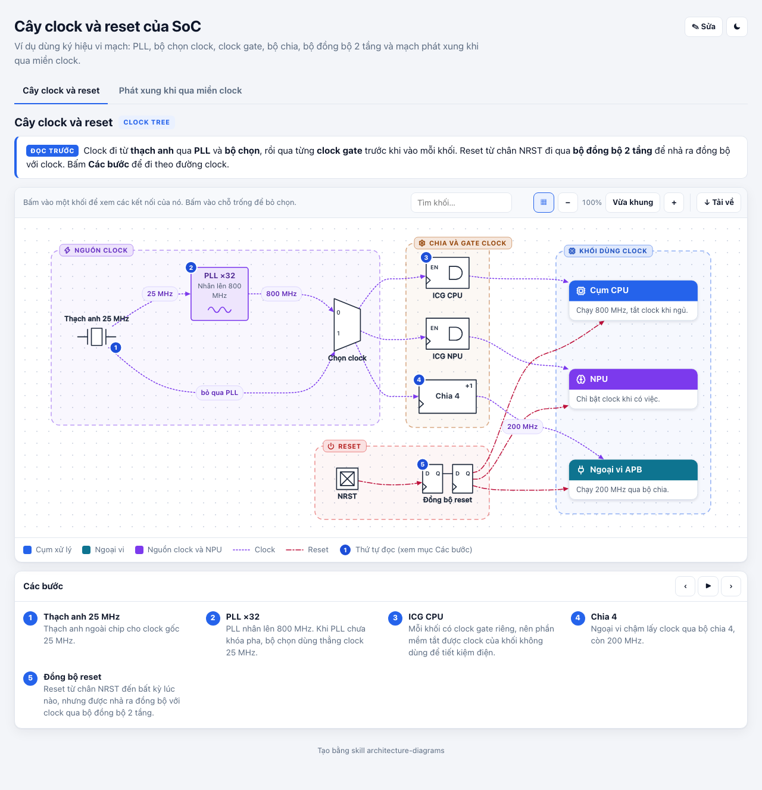
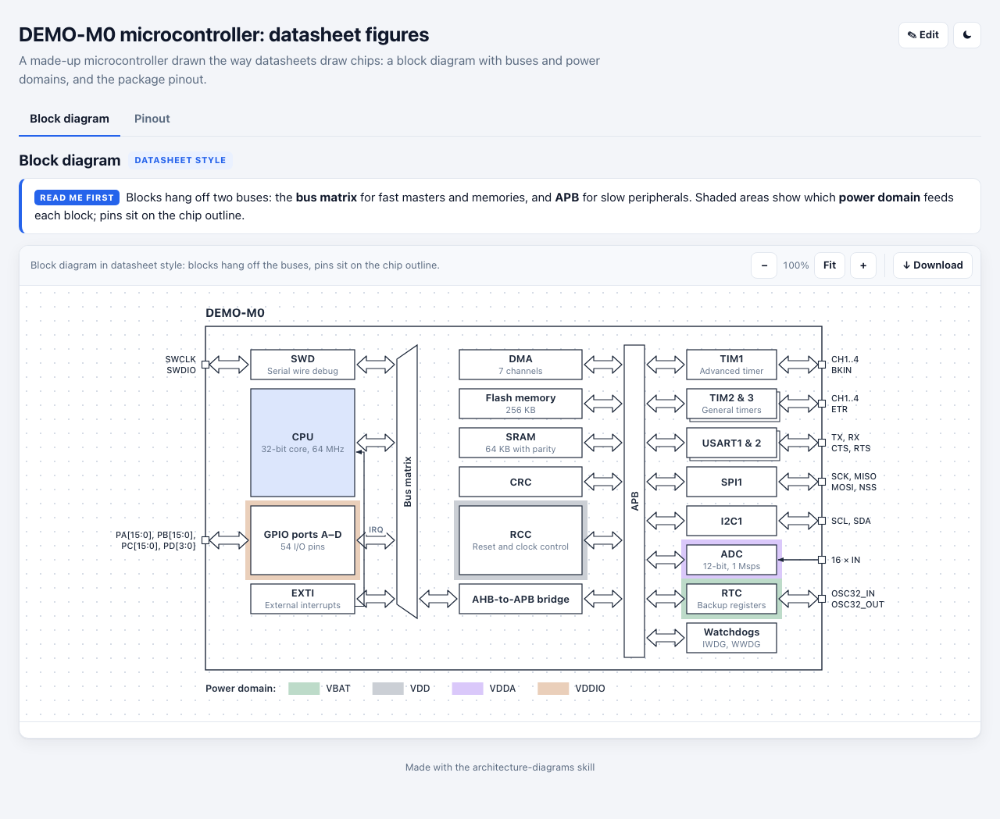
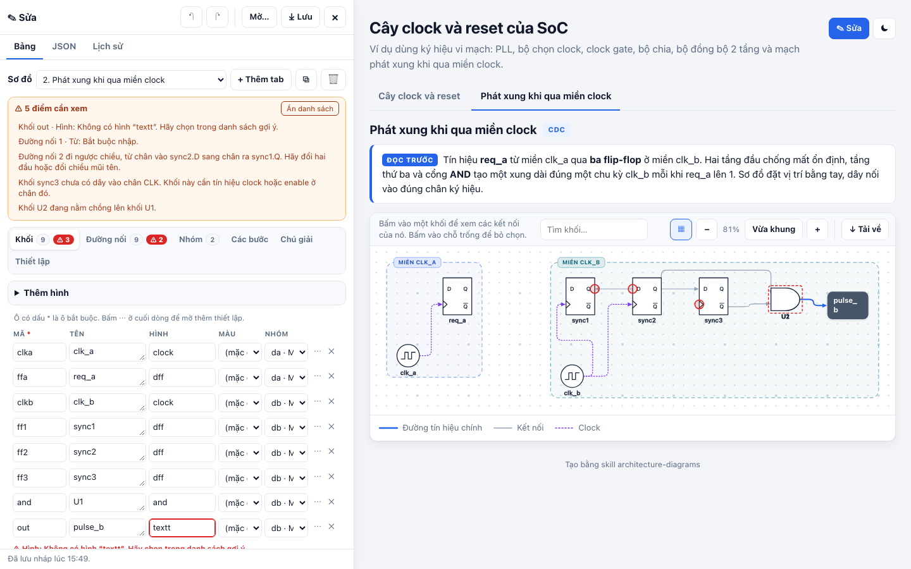
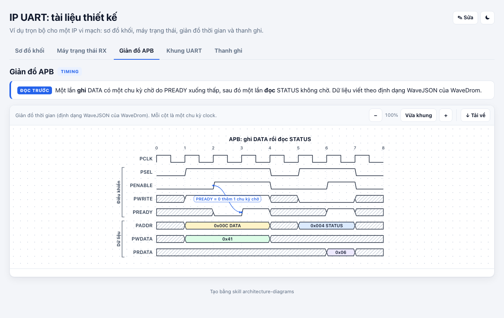
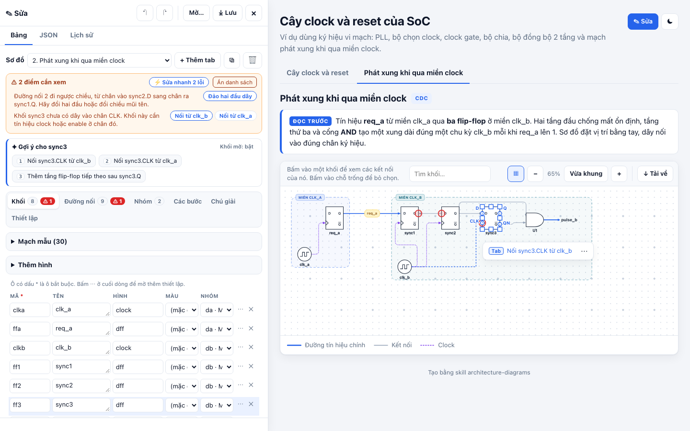
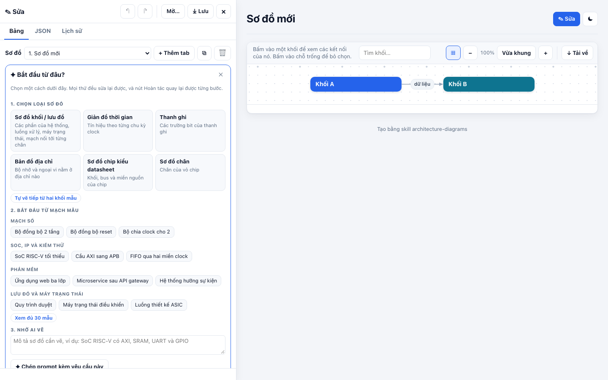

# Architecture Diagrams

Vẽ sơ đồ cho phần mềm và thiết kế vi mạch thành **một trang HTML tương tác**. Trang chạy không cần mạng và mở, lưu được file **draw.io**. Dùng được với Claude, với mọi agent hỗ trợ MCP, với AI chat bất kỳ, hoặc không cần AI.

*English: [see below](#english).*

**Xem thử ngay trên web:** [các trang mẫu](https://quangdangle.github.io/architecture-diagrams-skill/) và [trình sửa trống](https://quangdangle.github.io/architecture-diagrams-skill/editor.html).

| | |
| --- | --- |
|  |  |
|  |  |
|  |  |

## Tiếng Việt

### Tool làm được gì

- **Phần mềm:** sơ đồ kiến trúc, sơ đồ khối, luồng xử lý, pipeline dữ liệu, quy trình có duyệt và làm lại, máy trạng thái. Có sẵn 165 biểu tượng Lucide.
- **Vi mạch:** cây clock và reset, mạch CDC, sơ đồ mạch vẽ tới từng chân. Bộ ký hiệu gồm cổng logic, flip-flop, mux, PLL, ADC, linh kiện thụ động và transistor.
- **Hình kiểu datasheet:** giản đồ thời gian theo định dạng WaveDrom, bản đồ thanh ghi, bản đồ địa chỉ, sơ đồ chip có bus và miền nguồn, sơ đồ chân LQFP, QFN, SOIC, BGA.
- **Trình sửa ngay trong trang:**
  - Bảng nhập liệu chia theo tab: khối, đường nối, nhóm, các bước, chú giải, thiết lập.
  - Ô bắt buộc có dấu `*`; mỗi ô có ghi chú; ô nhập sai có viền đỏ và lời giải thích ngay bên dưới.
  - Kéo thả, nối dây vào đúng chân, chọn nhiều khối, căn hàng, chép và dán.
  - Sửa chữ ngay trên hình, dán bảng từ Excel.
  - Hoàn tác, có lịch sử từng bước và các mốc đã lưu.
- **Sửa nhanh, mạch mẫu và gợi ý:**
  - Lỗi nối dây và lỗi gõ tên trong mục Kiểm tra có nút sửa ngay. Ví dụ: đảo chiều dây bị ngược, nối chân clock còn trống vào nguồn clock cùng miền, dời khối bị chồng. Một nút khác sửa hết các lỗi chắc chắn chỉ có một cách sửa, gộp thành một bước để hoàn tác. Tên gõ sai chỉ được sửa tự động khi không lẫn với tên nào khác.
  - Có 30 mạch mẫu chia 4 nhóm, chèn bằng một lần bấm. Mỗi mẫu có đủ tên, hình, màu, nhãn dây và nhãn tín hiệu vào ra, hiện ngay trên hình:
    - Mạch số: bộ đồng bộ 2 tầng, bộ đồng bộ reset, bộ đồng bộ xung, cổng clock, bộ chia clock cho 2. Thêm bộ phát hiện sườn lên, thanh ghi dịch, thanh ghi có tín hiệu cho phép và LFSR.
    - SoC, IP và kiểm thử: SoC RISC-V tối thiểu, cầu AXI sang APB, bus TL-UL, FIFO qua hai miền clock, khối UART, khối SPI, cây clock và reset, môi trường kiểm thử UVM.
    - Phần mềm: ứng dụng web ba lớp, microservice sau API gateway, hệ thống hướng sự kiện, ứng dụng không máy chủ, đường dữ liệu, pipeline học máy, triển khai Kubernetes, pipeline CI/CD.
    - Lưu đồ và máy trạng thái: quy trình duyệt, đăng nhập có giới hạn thử lại, máy trạng thái điều khiển, máy trạng thái nhận UART, luồng thiết kế ASIC.
  - Chèn cạnh khối đang chọn thì mẫu tự nối vào khối đó (mạch thì nối theo từng chân), chạy theo clock của khối đó và không đè lên khung nhóm khác.
  - Chọn một khối thì tool gợi ý nối chân còn trống và khối nên thêm tiếp theo. Gợi ý khác nhau theo loại sơ đồ:
    - Mạch: tầng flip-flop tiếp theo, đồng bộ sang miền clock khác.
    - SoC vẽ bằng thẻ: bus, SRAM, cầu sang APB, ngoại vi, đường ngắt.
    - Phần mềm: API, dịch vụ, cơ sở dữ liệu, cache, hàng đợi.
    - Lưu đồ: bước tiếp theo, bước kiểm tra có hoặc không, nhánh quay lại.
    - Máy trạng thái: trạng thái tiếp theo, quay về trạng thái đầu.
  - Khi không chọn khối nào, khung Gợi ý hiện **Bước tiếp theo** cho cả sơ đồ. Ví dụ: nối lại hai khối vừa mất khối ở giữa, nối khối đang đứng riêng, vẽ tiếp ở cuối chuỗi. Bấm phím số 1 đến 8 để làm theo gợi ý mang số đó. Người mới chỉ cần bấm Tab và phím 1 là sơ đồ lớn dần mà không sinh lỗi.
  - Ở tab đặt vị trí bằng tay, khối nên vẽ tiếp hiện mờ ngay trên hình, giống tự điền: bấm Tab để thêm, bấm Tab lần nữa để vẽ tiếp. Ai thấy vướng thì tắt khối mờ bằng nút trong khung Gợi ý.
  - Gõ tên khối thì tool gợi ý hình hợp với tên, ví dụ gõ "SRAM" gợi ý hình RAM, gõ "Còn hàng?" gợi ý hình thoi quyết định.
  - Tab mới hoặc còn trống có khung **Bắt đầu từ đâu?**. Trong khung có thể chọn loại sơ đồ, bắt đầu từ mạch mẫu, gõ mô tả để nhờ AI vẽ, hoặc mở file và dán bảng có sẵn.
- **draw.io:** mở file `.drawio` và vẽ giống hệt draw.io, sửa xong lưu lại thành `.drawio`. Những phần không bị sửa được giữ nguyên như cũ.
- **Xuất file:** SVG, PNG, Mermaid, CSV. Có nút chép ảnh để dán thẳng vào Word, PowerPoint hoặc Teams.
- **Không cần cài gì, không cần mạng, không cần Figma.** Chỉ cần một trình duyệt.

### Bốn cách dùng

1. **Với Claude** (Claude Code, ứng dụng Claude): cài thư mục `architecture-diagrams` làm skill, rồi nhờ Claude vẽ, ví dụ "vẽ cây clock của SoC này" hoặc "mở file design.drawio và thêm khối DMA".
2. **Với agent khác qua MCP** (Codex CLI, Cursor, VS Code, Gemini CLI, Claude Desktop): đăng ký `architecture-diagrams/scripts/mcp_server.py`. Agent sẽ có sẵn 12 công cụ. Tám công cụ để đọc định dạng, kiểm tra, dựng trang, mở trình sửa, xuất file, nhập draw.io, quét code và tra ký hiệu. Bốn công cụ còn lại để liệt kê mạch mẫu, chèn mạch mẫu, sửa sơ đồ bằng thao tác nhỏ, và lấy gợi ý kèm cách sửa cùng bước tiếp theo.
3. **Với AI chat bất kỳ** (ChatGPT, Gemini, Copilot):
   - Mở một trang do tool dựng, bấm ✎ Sửa, vào tab JSON rồi bấm **Chép prompt cho AI**.
   - Dán vào khung chat và gõ yêu cầu vào cuối.
   - Dán JSON mà AI trả về vào tab JSON rồi bấm Áp dụng.
   - Không muốn mở trang thì dùng [PROMPT.md](PROMPT.md).
4. **Không cần AI:** mở `docs/editor.html` rồi nhập bảng, dán từ Excel, kéo thả và nối dây bằng tay.

### Cài đặt

- Tải file zip ở mục [Releases](https://github.com/quangdangle/architecture-diagrams-skill/releases), hoặc chạy `git clone https://github.com/quangdangle/architecture-diagrams-skill.git`.
- **Claude Code:** chép thư mục `architecture-diagrams` vào `~/.claude/skills/`.
- **Ứng dụng Claude:** tải file `architecture-diagrams.zip` lên phần Skills trong Settings.
- **MCP** (thay `<repo>` bằng thư mục đã tải):
  ```bash
  claude mcp add architecture-diagrams -- python3 <repo>/architecture-diagrams/scripts/mcp_server.py
  ```
  Codex CLI dùng `codex mcp add` với cùng tham số. Cursor, VS Code, Gemini CLI và Claude Desktop dùng file cấu hình JSON:
  ```json
  {"mcpServers": {"architecture-diagrams": {"command": "python3", "args": ["<repo>/architecture-diagrams/scripts/mcp_server.py"]}}}
  ```
- **Yêu cầu:** Python 3.8 trở lên, không cần thư viện ngoài. Muốn xuất PNG, SVG hoặc draw.io bằng dòng lệnh thì máy cần có Chrome, Edge, Chromium hoặc Brave.

### Dùng bằng dòng lệnh

```bash
python3 architecture-diagrams/scripts/build.py architecture-diagrams/examples/clock-reset-tree.json -o clock.html
python3 architecture-diagrams/scripts/export.py clock.html --format drawio
python3 architecture-diagrams/scripts/build.py design.drawio -o design.html
python3 architecture-diagrams/scripts/export.py design.drawio --format spec -o design.json
python3 architecture-diagrams/scripts/scan_code.py path/to/rtl -o rtl.json --lang vi
python3 architecture-diagrams/scripts/build.py --editor -o editor.html
python3 architecture-diagrams/scripts/assist.py --patterns --lang vi
python3 architecture-diagrams/scripts/assist.py design.json --pattern sync2 --near ff3 -o design.json
python3 architecture-diagrams/scripts/assist.py design.json --suggest
```

### Điều kiện nhập và kiểm tra nối dây

- Ô nào bắt buộc thì có dấu `*`. Nhập sai định dạng thì ô hiện viền đỏ kèm lời giải thích, ví dụ bit phải có dạng `7:4`, địa chỉ phải là số hex hoặc thập phân.
- Mỗi chân của ký hiệu có tên và chiều. Ví dụ flip-flop có chân vào D, chân clock CLK, chân ra Q và QN.
- Khi kéo dây, tool hiện tên chân và tô đỏ chân không hợp lệ.
- Mục **Kiểm tra** ở đầu bảng liệt kê mọi lỗi. Bấm vào một lỗi để nhảy tới đúng ô hoặc đúng đường nối; bấm nút bên cạnh để sửa ngay. Tool bắt được các lỗi sau:
  - dây đi ngược chiều;
  - hai chân ra nối với nhau;
  - một chân vào nhận hai nguồn;
  - flip-flop chưa có clock;
  - hai khối nằm chồng lên nhau.
- `validate.py` và MCP server kiểm tra theo đúng các quy tắc này, nên AI cũng được cảnh báo khi nối sai.

### Trình duyệt

Tool chạy trên Chrome và Edge bản mới, Firefox từ bản 113 và Safari từ bản 16.4. Bộ kiểm thử tự động hiện chạy trên Chrome. Trang đã nhúng sẵn mọi thư viện, nên mở được trên máy thiết kế không nối internet.

### Giấy phép

Mã nguồn dùng giấy phép [MIT](LICENSE), được dùng cho dự án thương mại. Các thư viện bên thứ ba gồm dagre (MIT), biểu tượng Lucide (ISC) và thư viện hình draw.io (Apache 2.0) được ghi trong [THIRD_PARTY_NOTICES.md](THIRD_PARTY_NOTICES.md).

## English

Diagrams for software and chip design as one interactive HTML page that works offline and opens and saves draw.io files. It works with Claude, any MCP agent, any AI chat, or no AI at all. Try it online: [examples](https://quangdangle.github.io/architecture-diagrams-skill/) and [an empty editor](https://quangdangle.github.io/architecture-diagrams-skill/editor.html).

**What it draws.** Software architecture, block diagrams, request flows, pipelines, processes and state machines; chip design figures: clock and reset trees, CDC circuits and schematics wired pin by pin (gates, flip-flops, mux, PLL, ADC, passives, transistors), WaveDrom timing diagrams, register maps, address maps, datasheet chip diagrams and LQFP, QFN, SOIC or BGA pinouts.

**What the page does.** Zoom, pan, overview map, search, click-to-highlight and a numbered walkthrough. The built-in editor has tables grouped by part with required fields, notes and inline errors, a Checks list, drag and drop, pin-aware wiring, multi-select with alignment, copy and paste, text editing on the drawing, Excel paste and undo with a named history. Wiring and naming problems in Checks have quick fixes (swap a backwards wire, wire an open clock pin to the clock of its domain, move stacked blocks), and one button applies every fix that is certain: a misspelled name is fixed only when no other name is as close. Thirty ready-made patterns in four groups insert with one click, complete with names, colors, wire labels and named inputs and outputs, and wire themselves to the selected block, on its clock and clear of other group frames. Digital circuits: 2-flop, reset and pulse synchronizers, clock gate, divide-by-2, rising-edge detector, shift register, register with enable, LFSR. SoC, IP and verification: minimal RISC-V SoC, AXI-to-APB bridge, TL-UL crossbar, asynchronous FIFO, UART and SPI blocks, clock and reset tree, UVM testbench. Software: three-tier web app, microservices behind an API gateway, event-driven services, serverless app, data pipeline, machine-learning pipeline, Kubernetes deployment, CI/CD. Flowcharts and state machines: approval process, sign-in with retries, control state machine, UART receiver, ASIC design flow. Selecting a block shows suggestions for its kind of diagram: circuits (the next flip-flop stage, a synchronizer into another clock domain), SoC block diagrams (bus, SRAM, APB bridge, peripherals, interrupts), software (API, service, database, cache, queue), flowcharts (the next step, a yes/no check, a branch back) and state machines (the next state, back to the start). With nothing selected, Next steps covers the whole tab: rejoin two blocks after the one between them is deleted, connect blocks that stand alone, carry on at the end of a chain. Keys 1 to 8 apply a suggestion, and in a hand-placed tab the top one appears faintly on the drawing: Tab adds it, like autocomplete (a button turns the preview off). Typing a block's name suggests the shape that fits it ("SRAM" gives the RAM symbol). An empty tab opens with a "where to start" panel: pick a kind of diagram or a pattern, describe it for an AI, or bring your data. It opens and saves draw.io files (untouched cells come back unchanged) and exports SVG, PNG, Mermaid and CSV, or copies the picture for Word, PowerPoint and Teams. Everything is embedded, so it works offline.

**Four ways to use it.**
1. **Claude** (Claude Code or the Claude apps): install the `architecture-diagrams` folder as a skill (`~/.claude/skills/` for Claude Code; upload the zip under Settings > Skills in the apps).
2. **Any MCP client** (Codex CLI, Cursor, VS Code, Gemini CLI, Claude Desktop): register `architecture-diagrams/scripts/mcp_server.py` (commands above). Tools: `diagram_guide`, `diagram_validate`, `diagram_build`, `diagram_open_editor`, `diagram_export`, `diagram_import_drawio`, `diagram_scan_code`, `diagram_symbols`, `diagram_patterns`, `diagram_insert_pattern`, `diagram_apply_ops`, `diagram_suggest`. On the command line, `scripts/assist.py` does the same (`--patterns`, `--pattern ID --near BLOCK`, `--ops FILE`, `--suggest`).
3. **Any AI chat:** in a page's editor, JSON tab, press **Copy prompt for AI**, paste it into ChatGPT, Gemini or Copilot with your request, then paste the JSON answer back and press Apply. [PROMPT.md](PROMPT.md) has the same prompt.
4. **No AI:** open `docs/editor.html`, fill in the tables or paste from Excel, drag and wire by hand.

**Requirements.** Python 3.8+ with its standard library. Command-line PNG, SVG and draw.io export needs Chrome, Edge, Chromium or Brave. Browsers: recent Chrome and Edge, Firefox 113+, Safari 16.4+.

**Documentation.** [SKILL.md](architecture-diagrams/SKILL.md) (workflow), [spec reference](architecture-diagrams/references/spec.md), [symbols and pins](architecture-diagrams/references/symbols.md), [design guide](architecture-diagrams/references/design-guide.md), [examples](architecture-diagrams/examples).

**License.** [MIT](LICENSE); third-party parts in [THIRD_PARTY_NOTICES.md](THIRD_PARTY_NOTICES.md).

## Development

```bash
python3 tests/interaction_test.py          # browser tests: every example, the editor, checks, quick fixes, patterns, draw.io round trip
python3 -m unittest discover tests         # scanner, validator, patterns and operations, MCP server, generated docs
python3 tools/make_docs.py                 # rewrite references/symbols.md and PROMPT.md after changing symbols, icons or stencils
```

`tools/vendor_icons.py` and `tools/vendor_stencils.py` refresh the Lucide icons and the draw.io stencil libraries at pinned commits.
